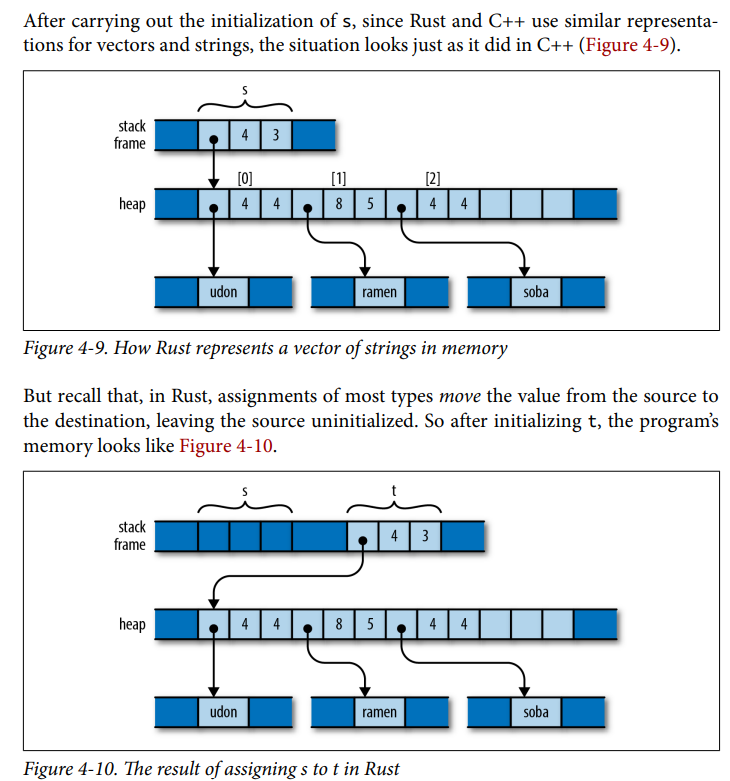

# Chapter 4: Ownership

## Moves - Basic Ideas

We have a Rust code here that wants to understand what exactly Rust means by "Moving Ownership"

```rust
let heap_v0 = Box::new(5);
let heap_v1 = heap_v0;
let heap_v2 = heap_v1;
let heap_v3 = heap_v2;


let x0: u64 = 5;
let x1: u64 = 10;
let x2: u64 = 3;

let y0: u64 = 5;
let y1: u64 = 10;
let y2: u64 = 3;
```

Which produces an output

```bash
Moving Heap values by assignment to heap_v0, heap_v1, heap_v2, and heap_v3
heap_addr_v0 = 0x55adc8cd8ad0
stack_addr_v0 = 0x7ffcc3ecc0b8

heap_addr_v1 = 0x55adc8cd8ad0
stack_addr_v1 = 0x7ffcc3ecc148

heap_addr_v2 = 0x55adc8cd8ad0
stack_addr_v2 = 0x7ffcc3ecc1d8

heap_addr_v3 = 0x55adc8cd8ad0
stack_addr_v3 = 0x7ffcc3ecc268

...

Moving Heap values by assignment to heap_y0, heap_y1, heap_y2, and heap_y3
stack_addr_x0 = 0x7ffcc3ecc328
stack_addr_x1 = 0x7ffcc3ecc330
stack_addr_x2 = 0x7ffcc3ecc338
stack_addr_y0 = 0x7ffcc3ecc448
stack_addr_y1 = 0x7ffcc3ecc450
stack_addr_y2 = 0x7ffcc3ecc458
```
Which clears certain ambiguities
- The data that's contained from a particular memory block aren't literally moved. It's the ownership that was being moved. It's like an individual land owner owning a piece of land and then he sells it to another individual. What's being "moved" is the ownership, and not the actual piece of data.
- The information about the pointer, and capacity are stored in a different stack addresses when move occurs.
- Assignment at stack-based values are copied and not moved. This is evident on how stack addresses are incremented.

This is clearly illustrated in this diagram.



The main consequence here is that the assignment are cheap.

**Source Code:** `move_ownership/`

### Rule in Ownership
- There's one owner at a time.
- When the owner goes out of scope, the memory referenced by that owner becomes uninitialized. You cannot access it any longer.

## Moves - Move Operations that Moves

Again, we have a rust code here
```rust
let mut s0 = "Corgi";
let s1 = s0;
s0 = "Beagle";
```

Which produces the heap/stack address in this manner
```bash
heap_s0 = 0x562398b0d05b
stack_s0 = 0x7ffc134c3ec0
heap_s1 = 0x562398b0d05b
stack_s1 = 0x7ffc134c3f58
heap_s0 = 0x562398b0d08b
stack_s0 = 0x7ffc134c3ec0
```
- This shows that we can reinitialize previously freed variables to something new. As long that particular value is mutable.

**Source Code:** `move_and_move/`

### Key Insights from the Previous Examples
- First, the moves always apply to the value proper, not the heap storage.
- Second, the Rust compiler's code generation is good at "seeing through" all these moves; in practice the machine code often stores the value directly where it belongs.
- Direct assignment does trigger moves. To prevent unintended moves, we can definitely "Borrow" instead of moving.

### Moves and Indexed Content

```rust
let x0 = vec![
    String::from("Corgi"), 
    String::from("Beagle"), 
    String::from("Daschund")
];

let v0 = x0[0];    // This is illegal: you cannot move out of index
let v1 = x0[1];    // This is illegal: you cannot move out of index

println!("v0 = {}", v0);
println!("v1 = {}", v1);

// This won't compile
println!("x0[0] = {}", x0[0]);
println!("x0[1] = {}", x0[1]);

```
This elicits `error[E0507]: cannot move out of index of Vec<String>`

The Solution for this is straightforward

```rust
let x0 = vec![
    String::from("Corgi"), 
    String::from("Beagle"), 
    String::from("Daschund")
];

let v0 = &x0[0];    // Borrow &x0[0] instead of move
let v1 = &x0[1];    // Borrow &x0[1] instead of move

println!("v0 = {}", v0);
println!("v1 = {}", v1);

// This won't compile
println!("x0[0] = {}", x0[0]);
println!("x0[1] = {}", x0[1]);
```

Again, this forces us to pay attention on Moving/Borrowing. In this manner, the proper way of allocating resources are enforced by the compiler. 

This begs a question though. Can you move a child outside of any parent aside from `Vec<T>`?

**Source Code:** `move_and_index/`

### Moves and Struct Members

```rust
// This will not compile
struct Dog {
    name: &str,
    physique: &str,
}

fn main() {
    let dog = Dog {
        name: "Corgi",
        physique: "Short",
    };

    let _name = dog.name;               // Moves from dog.name -> _name
    let _physique = dog.physique;       // Moves from dog.physique -> _physique

}
```
- Answer is no. You cannot without certain restrictions. This is because messing with the hierarchy of ownership (i.e. Moving from outside the scope) will expose Rust to dangling pointers. Whenever the Rust compiler detects moving data from inner to outside of the scope, it will become defensive because it cannot infer when to place its destructor since it assumes that there's one owner at a time.
- A Workaround with this is you have to annotate its lifetimes with lifetime parameter.

```rust

struct Dog<'a> {
    name: &'a str,                      // ensures the name is always owned by Dog struct
    physique: &'a str,                  // ensures the physique is always owned by Dog struct
}

fn main() {
    let dog = Dog {
        name: "Corgi",
        physique: "Short",
    };

    let _name = dog.name;               // Moves from dog.name -> _name
    let _physique = dog.physique;       // Moves from dog.physique -> _physique

    println!("dog.name = {:p}", dog.name);
    println!("_name = {:p}", dog.name);
}

```
- This should be discussed more clearly on the next chapter. For now, I'll avoid overthinking this.
## Additional Homework
- Understand Ownership Hierarchies.
- Investigate `std::mem`