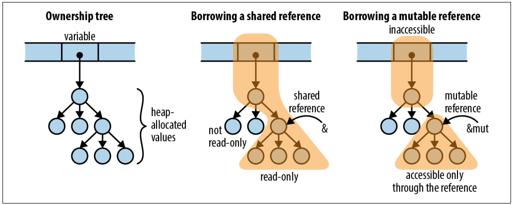

# Chapter 5 - References

## Two Kinds of Reference
1. **Shared Reference**
- Lets you read but not modify its referent.
- It allows you to have many shared references to a particular value at a time as you like.

2. **Mutable Reference/Exclusive Reference**
- Lets you to both read/write its referent.
- You're only allowed to have one Exclusive Reference at a time.

Its **Multiple Reader/Single Writer** rule at a compile time. Also, **References are nonowning pointers**.

### Stuff that you can Reference Directly
- Variables that lives in the Stack (Safe)
- Variables that lives in the Heap (Safe)
- Functions and Closures (Safe)
- Arbitrary Integers (Unsafe)

### On Fat Pointers
- Fat Pointers are special kind of pointers compared to simple addresses.
- Fat Pointers contains the address as well as the length.

### On Reading Lifetimes
Let say we have a lifetime parameter `'a` which is read **tick A**
```rust
fn f<'a>(p: &'a i32) { ... }
```
- You can read `<'a>` as "for any lifetime `'a`"
- We're defining a function that takse a reference to an `i32` with any given lifetime `'a`

### On Static Lifetimes
- If we are taking mutable static references as an argument in a function, we must ensure that we annotate it with `'static` lifetime parameter, to ensure that the referant will not be outlived when the scope ends.

### Further Reitaration on Lifetimes
- The rule of thumb is that reference must not outlive the referant. If you're returning a reference from within a certain scope like vector elements or a member of the struct and you want to ensure that the lifetime within that scope was preserved -- you can explicitly annotate that particular lifetime with `'a`.

### Diagram for Shared References VS Mutating References



### Personal Comments
- Rust is pretty explicit on how you indicate passing by references and passing by value. This forces the programmer to pay more attention on how data was being moved. This is not so clear in higher languages like Python.
- Also, indicating a difference between shared references VS mutable references makes it more natural to guard against unintended side-effects like the following code snippet.
- References are never null. And attempts to do so will result to a compilation error -- unless you explicitly converted an integer to references within the `unsafe` code.


**Without Side Effects**
```rust
fn sort_vec(target_vec: &Vec<u8>) {
    ...
}
```

**With Side Effects**
```rust
fn sort_vec(target_vec: &mut Vec<u8>){
    ...
}
```

### On Implicit Dereferences
Let say you have the following code

```rust
struct Nice {x: u8, y: u8};

fn main() {
    let nice = Nice {x: 2, y:3};
    let nice_ref = &nice;

    // Implicit Dereferencing Happens here
    println!("{}", nice_ref.x);

    // Implicit Dereferencing Happens here as well
    println!("{}", nice_ref.y);
}

```

### Additional Homework
- Read further on ways Rust can be implicit in **dereferencing references**.
- Does dereferencing transfer ownership?